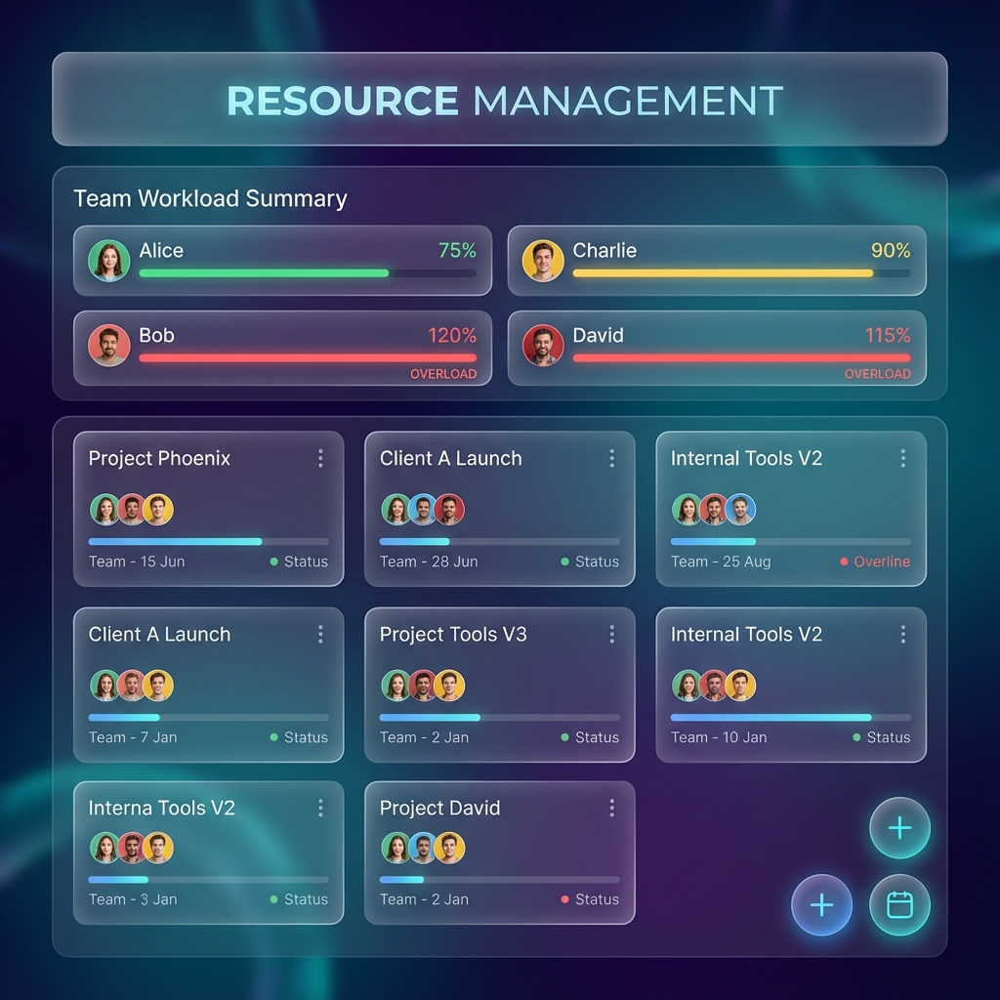

# Resource Management Dashboard

A modern, glassmorphic resource management tool built with React and Vite. This application allows you to manage projects, assign team members, and track workload allocations in a visually stunning interface.



## Features

- **Project Management**: Create, edit, and delete projects with ease.
- **Team Workload Tracking**: Visual progress bars show user allocation percentages.
- **Over-allocation Warnings**: Automatically highlights when a team member is assigned more than 100% work.
- **Drag & Drop**: Reorder projects using a smooth drag-and-drop interface powered by `@dnd-kit`.
- **Glassmorphic UI**: A premium dark mode design with blurred glass effects and vibrant colors.
- **Data Persistence**: All data is saved locally to your browser, so you never lose your progress.
- **Import/Export**: Easily backup or transfer your data.

## Tech Stack

- **Framework**: React 19
- **Build Tool**: Vite
- **Language**: TypeScript
- **Styling**: Vanilla CSS (Variables & Custom Properties)
- **drag-and-drop**: @dnd-kit/core
- **Utilities**: html2canvas (for export features)

## Getting Started

1.  **Clone the repository**
    ```bash
    git clone <repository-url>
    ```

2.  **Install dependencies**
    ```bash
    npm install
    ```

3.  **Run the development server**
    ```bash
    npm run dev
    ```

4.  **Build for production**
    ```bash
    npm run build
    ```

## Deployment

The project is optimized for deployment on Netlify.

1.  Run the deploy command:
    ```bash
    npx netlify deploy
    ```
